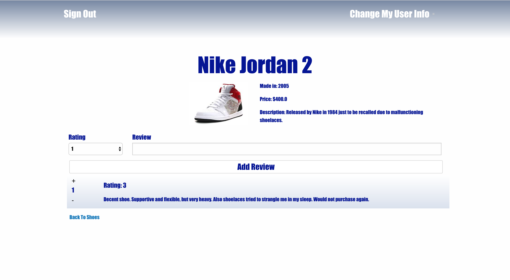

[ ](https://codeship.com/projects/196544)

[](https://coveralls.io/github/eewilcox/SoleMate?branch=master)

[](https://codeclimate.com/github/eewilcox/SoleMate)

# SoleMate

## Description

Heroku Link: https://solemate.herokuapp.com/

SoleMate is a website that allows users to post detailed descriptions of shoes. Users can also submit ratings and reviews for any shoe in our site's database. A user will receive an email whenever another user reviews a shoe they've posted. Users can also upvote or downvote a review, and that shoe's reviews will be sorted on the page by their vote score.



## Authors
* Kate Brown (https://github.com/kb8158)
* Dino Dourountoudakis (https://github.com/douroudous)
* John Nolan (https://github.com/JBNolan)
* Emma Wilcox (https://github.com/eewilcox)

## Features

* Creating and signing into a user account
* Adding shoes to the database
* Adding ratings/reviews for a shoe
* Upvoting/downvoting shoe reviews
* Emailing a user once their shoe has been reviewed

## Technologies

* Ruby on Rails
* ReactJS
* PostgreSQL
* CarrierWave
* Devise
* SendGrid

## Local Setup

```
git clone https://github.com/eewilcox/SoleMate.git
cd solemate
bundle install
npm install
rake db:create && rake db:migrate
```

## To-Do List

* Change colors on upvotes/downvotes based on user’s current review vote status
* API integration
* Expanding CarrierWave to allow users to upload shoe photos

## Contributing

Bug reports and pull requests are welcome on GitHub at https://github.com/eewilcox/SoleMate. Use the [fork-and-branch](http://blog.scottlowe.org/2015/01/27/using-fork-branch-git-workflow/) workflow to contribute.

This project is intended to be a safe, welcoming space for collaboration, and contributors are expected to adhere to the [Contributor Covenant](http://contributor-covenant.org) code of conduct.
